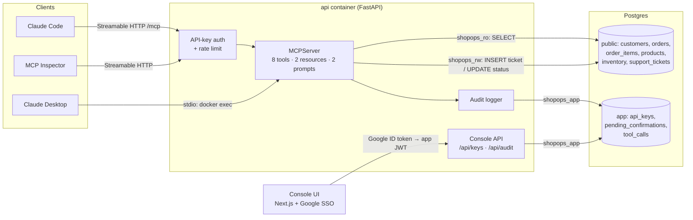

# ShopOps MCP: a secure MCP server for a business database

**Claude talks to your business database through read-only tools and confirmed writes.**

ShopOps is a production-style [Model Context Protocol](https://modelcontextprotocol.io) server. It gives Claude (Desktop, Claude Code) and any other MCP client safe access to the backend of a small e-commerce store: customers, orders, products, inventory and support tickets. It comes with a small console where you sign in with Google, issue API keys and watch every tool call.

> "Which products will run out this week, and which customers have open orders for them?"
> Claude chains `low_stock_products` → `list_orders` and answers from live data.
> It cannot run raw SQL, cannot read beyond what each tool returns, and cannot change an order without a confirmed preview.

## Why this design

Most "connect Claude to our database" prototypes expose an `execute_sql` tool with an admin connection string. ShopOps takes the opposite approach:

| Concern | What ShopOps does |
|---|---|
| **Least privilege in the database** | Three Postgres roles. Read tools use `shopops_ro` (SELECT only). Write tools use `shopops_rw`, which can only `INSERT` tickets and `UPDATE (status, updated_at)` on orders. API keys and the audit log live in their own schema under `shopops_app`. Tests prove each role is denied everything else. |
| **No raw SQL** | Eight typed, documented tools. Every query uses bound parameters; `LIKE` wildcards in user input are escaped. |
| **Confirmed writes** | `update_order_status` is two-step. The first call validates the transition and returns a **preview** plus a single-use `confirm_token` (5-minute expiry). The token is bound to the caller, the order and the target status. On apply, an optimistic-concurrency check makes sure nobody changed the order since the preview. |
| **Bounded output** | Every list tool is paginated (`limit` ≤ 100, `offset`, `next_offset`). `sales_summary` returns aggregates, never raw rows. |
| **Auth** | Streamable HTTP requires an API key (`Authorization: Bearer …`). Keys are created in the console after Google sign-in and only their SHA-256 hash is stored. Keys are scoped `read` or `read_write` and can be revoked. A per-key rate limit applies (120 requests per minute). stdio is for local use only. |
| **Audit** | Every tool call is logged as structured JSON and stored in `app.tool_calls`: who, which tool, the arguments (secrets redacted), duration and outcome (`ok` / `rejected` / `denied` / `error`). It is visible live in the console. |
| **Tool hints** | Read tools are annotated `readOnlyHint`; `update_order_status` is `destructiveHint`, so clients can ask for approval. |
| **Tests** | 43 pytest tests: every tool, the confirmation flow (reuse, expiry, wrong caller, concurrent change), database role denials, the MCP protocol in-process, and HTTP auth with real API keys. |

## Architecture



## What the server exposes

**Read tools** (read-only role, paginated)

| Tool | Purpose |
|---|---|
| `search_customers(query)` | Customers by name, email or city, with order count, lifetime value and open orders |
| `get_order(order_id)` | One order with its customer, line items and linked tickets |
| `list_orders(status, date_from, date_to, customer_id?, product_id?)` | Filtered order list, newest first |
| `low_stock_products(threshold?, within_days?)` | Available stock, days of cover and estimated stock-out date |
| `sales_summary(period)` | Aggregates compared with the previous period: revenue, AOV, units, top products, category mix |
| `search_tickets(query, status)` | Support tickets by text and status |

**Write tools** (`read_write` key required)

| Tool | Guard |
|---|---|
| `create_support_ticket(customer_id, subject, body, order_id?, priority?)` | Validates the customer and that the order belongs to them; length limits |
| `update_order_status(order_id, status, confirm_token?)` | Allowed-transition check → preview + `confirm_token` → apply with the token |

**Resources:** `schema://tables` (the business schema with table comments) · `docs://refund-policy`
**Prompts:** `weekly_sales_report` · `triage_ticket(ticket_id)`

## Run it

Requirements: Docker, and a Google OAuth client for the console.

```bash
make setup     # creates .env with random DB passwords, secrets and a bootstrap API key
# add GOOGLE_CLIENT_ID / GOOGLE_CLIENT_SECRET to .env
# (Google Cloud Console → Credentials → OAuth client → Web application,
#  redirect URI: http://localhost:3001/api/auth/callback/google)
make up        # = docker compose up --build -d
```

| | URL |
|---|---|
| Console | http://localhost:3001 |
| MCP endpoint (Streamable HTTP) | http://localhost:8001/mcp |
| API docs | http://localhost:8001/docs |

`docker compose up` starts Postgres, runs a one-shot `setup` container (roles → schema → seed data: 150 customers, 40 products, 500 orders, 120 tickets), then the API and the console.

### Connect Claude Code (remote)

```bash
claude mcp add --transport http shopops http://localhost:8001/mcp \
  --header "Authorization: Bearer <YOUR_API_KEY>"
```

### Connect Claude Desktop

Remote, through [`mcp-remote`](https://www.npmjs.com/package/mcp-remote) (`claude_desktop_config.json`):

```json
{
  "mcpServers": {
    "shopops": {
      "command": "npx",
      "args": ["-y", "mcp-remote", "http://localhost:8001/mcp", "--header", "Authorization: Bearer <YOUR_API_KEY>"]
    }
  }
}
```

Local, over stdio (runs inside the running `api` container; the caller is the local operator):

```json
{
  "mcpServers": {
    "shopops": {
      "command": "docker",
      "args": ["exec", "-i", "shopops-api-1", "python", "-m", "shopops.stdio"]
    }
  }
}
```

### MCP Inspector walkthrough

1. `npx -y @modelcontextprotocol/inspector`
2. Transport **Streamable HTTP**, URL `http://localhost:8001/mcp`.
3. Add the header `Authorization: Bearer <key>` (use `BOOTSTRAP_API_KEY` from `.env` or create a key in the console) and click **Connect**.
4. **Tools → `low_stock_products`** with `within_days = 7` → note a `product_id`.
5. **Tools → `list_orders`** with `status = ["pending","paid"]` and that `product_id`.
6. **Tools → `update_order_status`** with `order_id = 1042`, `status = shipped` → a preview with a `confirm_token`. Call again with the token → `applied: true`. Call a third time with the same token → rejected.
7. **Resources → `schema://tables`**, **Prompts → `triage_ticket`** with `ticket_id = 1`.
8. Open the console's **Audit log** tab: every call is there, with the token redacted.

## Demo script (Loom)

In Claude Desktop with ShopOps connected:

1. *"Which products will run out this week, and which customers have open orders for them?"* — `low_stock_products(within_days=7)` → `list_orders(product_id=…)` for each product.
2. *"Draft a weekly sales report."* — the `weekly_sales_report` prompt → `sales_summary` + `low_stock_products`.
3. *"Mark order 1042 as shipped."* — a preview (customer, items, total, open tickets) → you confirm → applied. Show the audit log.

## Tests

```bash
make test   # runs pytest inside the api container against a throwaway shopops_test database
```

```
tests/test_read_tools.py      every read tool, pagination caps, wildcard/SQL text handling
tests/test_write_tools.py     ticket validation, preview → confirm, token reuse / expiry / wrong caller / race
tests/test_db_roles.py        the database denies each role everything it should not do
tests/test_mcp_protocol.py    tools/resources/prompts over MCP, schema validation, HTTP API keys + scopes + revocation, audit rows
```

## Project layout

```
shopops/
  server.py        MCPServer: tools, resources, prompts, caller identity + audit wrapper
  tools/read.py    read queries (shopops_ro)
  tools/write.py   guarded writes + confirmation tokens (shopops_rw / shopops_app)
  api.py           FastAPI: /mcp (API-key middleware, rate limit) + console API
  keys.py          API key issue / verify (hash only)
  console_auth.py  Google ID token → app JWT
  audit.py         structlog JSON + app.tool_calls
  schema.sql       tables + least-privilege grants
  setup_db.py      roles, schema, seed (idempotent)
  seed.py          deterministic demo data
  stdio.py         stdio entrypoint
ui/                Next.js console (Auth.js Google provider)
```

## Stack

Python 3.12 · official MCP Python SDK (`mcp` 2.x `MCPServer`, Streamable HTTP + stdio) · FastAPI · PostgreSQL 17 · SQLAlchemy async + asyncpg · structlog · pytest · Next.js 16 + Auth.js (Google) · Docker Compose
